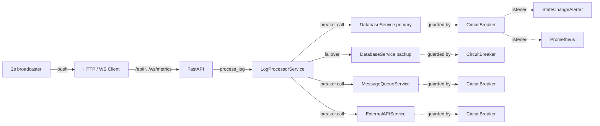

# Log Service Circuit Breaker Engine

A production-style three-state circuit breaker engine that wraps downstream service calls (database, message queue, external API) for a log-processing pipeline. Includes a FastAPI server, real-time WebSocket dashboard, CLI demo, Prometheus metrics, and state-change alerting.

## What this project demonstrates

- **Three-state circuit breaker** (CLOSED -> OPEN -> HALF_OPEN -> CLOSED) with smart detection: error-rate threshold, slow-call latency threshold, consecutive failures, and a low-volume gate.
- **Per-service breakers** with primary/backup database failover and fallback responses.
- **Cached fallback** — services return the last good payload (tagged `from_cache=True`) when their breaker is OPEN.
- **Recovery duration tracking** — rolling avg over last 10 cycles.
- **Failure injection** — toggleable `failure_rate`, `is_down`, `response_delay` per service.
- **Live dashboard** via WebSocket broadcasting metrics every 2s, with Plotly charts and interactive controls.
- **Observability** — Prometheus `/metrics` endpoint and `/api/alerts` state-change log.

## Tech Stack
- **Language:** Python 3.11
- **Web:** FastAPI 0.115 + uvicorn + WebSockets + Jinja2
- **Validation:** pydantic 2
- **Logging:** structlog (JSON output)
- **Observability:** prometheus-client
- **Frontend:** vanilla JS + Plotly.js (CDN)
- **Infra:** Docker + docker-compose, Redis sidecar (reserved for future use)
- **Testing:** pytest + pytest-asyncio (130+ tests, all run inside Docker)

## How to Run

```bash
# Build and start the stack
make build
make run            # http://localhost:8000/

# CLI demo (3 phases: happy path, failure storm, recovery)
make demo

# Run the unit + integration test suite (inside Docker)
make test

# End-to-end verification — boots stack, runs scripts/verify_e2e.py, tears down
make e2e

# Tail logs
make logs

# Stop and clean up
make stop
make clean
```

## API

| Method | Path | Description |
|---|---|---|
| GET | `/` | Plotly dashboard |
| GET | `/health` | `{"status":"ok","uptime_seconds":N}` |
| GET | `/api/metrics` | Combined registry snapshot + processing stats |
| GET | `/api/metrics/history` | Last ~300 metric snapshots from broadcaster |
| POST | `/api/process/logs` | Body `{"count": N}` — process N synthetic logs |
| POST | `/api/simulate/failures` | Body `{"target":"database_primary","duration":N,"failure_rate":0.8}` — toggle injector |
| POST | `/api/reset` | Reset all breakers + clear failure injectors |
| GET | `/api/alerts` | List of recent state-change events |
| GET | `/metrics` | Prometheus exposition (text/plain) |
| WS | `/ws/metrics` | Live JSON metrics, pushed every 2s |

## Environment Variables

| Variable | Default | Effect |
|---|---|---|
| `PORT` | 8000 | HTTP listen port |
| `WEBSOCKET_BROADCAST_INTERVAL` | 2.0 | Seconds between WS broadcasts |
| `LOG_LEVEL` | INFO | structlog level |
| `CB_DEFAULT_FAILURE_THRESHOLD` | 5 | Default `failure_threshold` for env-loaded configs |
| `CB_DEFAULT_RECOVERY_TIMEOUT` | 60 | Default `recovery_timeout` (seconds) |
| `CB_DEFAULT_TIMEOUT_DURATION` | 10 | Default per-call timeout |
| `CB_DEFAULT_HALF_OPEN_MAX_CALLS` | 3 | Probes admitted in HALF_OPEN |
| `CB_DEFAULT_MONITORING_WINDOW` | 60 | Sliding-window seconds |

See `.env.example` for the full set.

## Architecture



Each `CircuitBreaker` holds an `asyncio.Lock`-protected state machine, a sliding `CallWindow` for smart detection, and a `CircuitStats` snapshot that the dashboard and Prometheus exporter read from.

## What I Learned

- **Lock scope matters.** The `asyncio.Lock` only guards state mutation, not the awaited downstream call — otherwise a slow service blocks every concurrent caller.
- **Smart detection needs a volume gate.** Probabilistic noise on a low-volume sample shouldn't trip a breaker. The `min_volume_threshold` keeps the error-rate rule honest.
- **Listeners run inside the lock by design.** They must not re-enter the breaker, but this keeps event ordering deterministic for Prometheus counters.
- **Cached fallback >> static fallback.** Returning the last good payload tagged `from_cache=True` keeps the dashboard meaningful even during outages.
- **WebSocket + Plotly.react is fast.** Pushing a snapshot every 2s and re-rendering 4 traces of 150 points keeps the browser idle, no flicker.
- **Failure injection should live OUTSIDE the breaker.** Keeping `FailureInjector` as a separate component meant the breaker stayed deterministic in tests — no random seeds inside the state machine.
